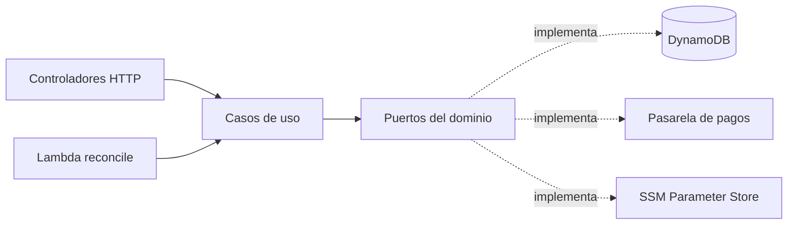
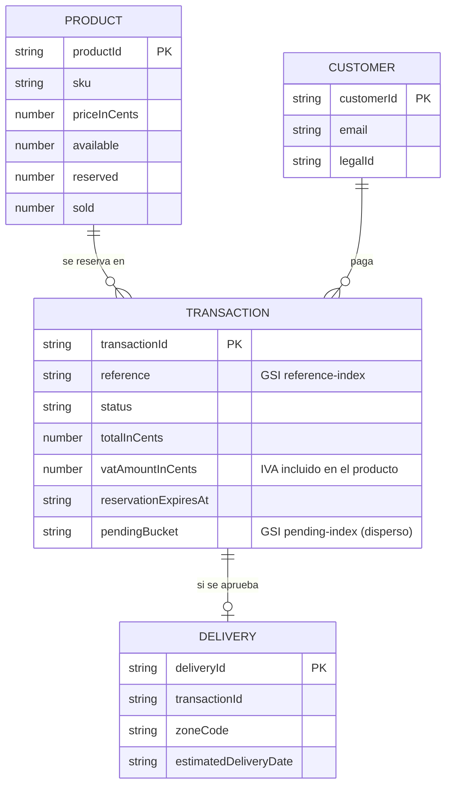

# Tech Store — API (checkout con tarjeta de crédito)

| Repositorio                                                                         | Contenido                                                         |
| ----------------------------------------------------------------------------------- | ----------------------------------------------------------------- |
| [tech-store-checkout-web](https://github.com/IamStivgo/tech-store-checkout-web)     | Frontend: SPA React                                               |
| [tech-store-checkout-api](https://github.com/IamStivgo/tech-store-checkout-api)     | Backend: API NestJS, Swagger y modelo de datos (este repositorio) |
| [tech-store-checkout-infra](https://github.com/IamStivgo/tech-store-checkout-infra) | Infraestructura: Terraform y despliegue en AWS                    |

API serverless en NestJS con arquitectura hexagonal y Railway Oriented Programming para una tienda de accesorios tecnológicos: catálogo, cotización de envío, clientes, transacciones con reserva de stock, pago con tarjeta a través de una pasarela de pagos (sandbox provisto en la prueba) y entregas.

**App:** https://d7vch0fsx8645.cloudfront.net · **API:** https://d7vch0fsx8645.cloudfront.net/api/v1 (`GET /api/v1/health` informa la versión desplegada)

## Documentación del API

| Recurso              | Enlace                                                                                                                                    |
| -------------------- | ----------------------------------------------------------------------------------------------------------------------------------------- |
| Swagger UI (público) | https://d7vch0fsx8645.cloudfront.net/api-docs/index.html                                                                                  |
| OpenAPI 3            | [`docs/openapi.json`](docs/openapi.json), adjunto también a cada [release](https://github.com/IamStivgo/tech-store-checkout-api/releases) |
| Colección Postman    | [`docs/postman/checkout-api.postman_collection.json`](docs/postman/checkout-api.postman_collection.json)                                  |

La colección de Postman recorre todo el API en orden (catálogo, cotización, cliente, transacción, pago, entrega, cancelación y webhook): cada petición guarda en variables los ids que usan las siguientes y verifica su respuesta. Para tokenizar la tarjeta contra la pasarela real hay que completar `providerBaseUrl` y `providerPublicKey` con los datos del sandbox; en local, con la pasarela falsa, basta con poner `cardToken` = `tok_fake_approved_4242_1`. También corre desde la terminal:

```bash
npx newman run docs/postman/checkout-api.postman_collection.json \
  --env-var "providerBaseUrl=https://<sandbox>/v1" --env-var "providerPublicKey=<llave pública>"
```

Todas las respuestas de error siguen Problem Details (RFC 9457) con un `code` estable, y los `POST` que crean recursos o cobran exigen `Idempotency-Key`.

## Endpoints

| Método | Ruta                                            | Descripción                                                    | Respuestas                             |
| ------ | ----------------------------------------------- | -------------------------------------------------------------- | -------------------------------------- |
| GET    | `/api/v1/health`                                | Estado y versión desplegada                                    | 200                                    |
| GET    | `/api/v1/products`                              | Catálogo activo con stock                                      | 200                                    |
| GET    | `/api/v1/products/{productId}`                  | Detalle con imágenes, stock y límite por pedido                | 200, 400, 404                          |
| GET    | `/api/v1/products/{productId}/stock`            | Stock actual (nunca en caché)                                  | 200, 400, 404                          |
| GET    | `/api/v1/locations/departments`                 | Departamentos (DIVIPOLA)                                       | 200                                    |
| GET    | `/api/v1/locations/departments/{code}/cities`   | Municipios con su zona de envío                                | 200, 400, 404                          |
| GET    | `/api/v1/checkout/quote`                        | Cotización calculada en el servidor                            | 200, 400, 404, 422                     |
| POST   | `/api/v1/customers`                             | Crea el cliente (idempotente)                                  | 201, 400, 409                          |
| GET    | `/api/v1/customers/{customerId}`                | Cliente con datos enmascarados                                 | 200, 400, 404                          |
| GET    | `/api/v1/payments/acceptance-tokens`            | Documentos a aceptar con tokens de un solo uso                 | 200, 502, 504                          |
| GET    | `/api/v1/payments/tokenization-key`             | Llave pública para cifrar la tarjeta en el navegador           | 200, 502, 504                          |
| POST   | `/api/v1/transactions`                          | Crea la transacción PENDING y reserva el stock (idempotente)   | 201, 400, 404, 409, 422                |
| GET    | `/api/v1/transactions/{transactionId}`          | Estado actual; si el pago sigue PENDING consulta a la pasarela | 200, 400, 404                          |
| PATCH  | `/api/v1/transactions/{transactionId}`          | Cancela una transacción sin pago enviado y libera el stock     | 200, 400, 404, 409                     |
| POST   | `/api/v1/transactions/{transactionId}/payment`  | Paga con el token de la tarjeta (idempotente)                  | 200, 202, 400, 404, 409, 422, 502, 504 |
| GET    | `/api/v1/transactions/{transactionId}/events`   | Bitácora de auditoría de la transacción                        | 200, 400, 404                          |
| GET    | `/api/v1/transactions/{transactionId}/delivery` | Entrega de una transacción aprobada                            | 200, 400, 404                          |
| GET    | `/api/v1/deliveries/{deliveryId}`               | Entrega con destinatario y dirección enmascarados              | 200, 400, 404                          |
| POST   | `/api/v1/webhooks/payment-events`               | Eventos de la pasarela verificados con checksum                | 200, 401                               |

## Arquitectura

### Hexagonal (puertos y adaptadores)

Cada módulo (`products`, `coverage`, `pricing`, `customers`, `payments`, `transactions`, `deliveries`) separa `domain/` (entidades, value objects y puertos), `application/` (casos de uso) e `infrastructure/` (HTTP, DynamoDB, pasarela). El dominio y la aplicación no importan paquetes de npm ni módulos de Node; `npm run lint:deps` (dependency-cruiser) lo verifica en el CI.



### Railway Oriented Programming

Los errores de negocio viajan como valores tipados `Result`/`ResultAsync` (`src/shared/domain/result.ts`) y se encadenan con `andThen`/`map`; solo los fallos inesperados lanzan excepciones. Cada controlador traduce el error al estado HTTP y a Problem Details.

### Errores, validaciones e idempotencia

- Validación de entradas con Zod en la frontera HTTP; los value objects repiten las reglas de negocio.
- `@Idempotent()` guarda por 24 h las respuestas 2xx y 4xx de negocio de cada `Idempotency-Key` y las repite con `Idempotent-Replayed: true` (incluidos `Location` y `Retry-After`).
- Endurecimiento: helmet, límite de 16 KB (413), 415 para cuerpos que no son JSON y `requestId` en cada respuesta.

## Modelo de datos

Seis tablas DynamoDB on-demand (PITR y protección contra borrado). El stock vive en el producto (`available`, `reserved`, `sold`) y cada cambio de estado de una transacción se escribe con `TransactWriteItems` junto con el stock y la entrega, todo o nada.



| Tabla                | Clave                        | Índices                                           | Patrones de acceso                                                                        |
| -------------------- | ---------------------------- | ------------------------------------------------- | ----------------------------------------------------------------------------------------- |
| `products`           | `productId`                  | —                                                 | Catálogo, detalle y stock; reserva, venta y liberación con escrituras condicionales       |
| `customers`          | `customerId`                 | —                                                 | Crear y consultar clientes                                                                |
| `transactions`       | `transactionId`              | `reference-index`; `pending-index` (solo PENDING) | Consultar, pagar, buscar por referencia (webhook) y conciliar las pendientes sin escanear |
| `deliveries`         | `deliveryId`                 | —                                                 | Consultar la entrega (la transacción guarda su `deliveryId`)                              |
| `idempotency-keys`   | `idempotencyKey`             | TTL `expiresAt`                                   | Repetir respuestas de `POST`                                                              |
| `transaction-events` | `transactionId` + `eventKey` | —                                                 | Bitácora de auditoría append-only, en orden cronológico                                   |

**Reserva de stock:** crear la transacción mueve unidades de `available` a `reserved` en la misma escritura atómica (con condición de stock suficiente). Un pago aprobado las pasa a `sold` y crea la entrega; un pago rechazado, una cancelación o una reserva vencida las devuelve a `available`.

## Reglas de negocio

- Todos los montos son enteros en centavos (COP) y se calculan en el servidor; el total del web es informativo.
- Tarifa de servicio: $ 3.000 por compra, sin IVA.
- IVA: el precio del producto ya incluye el 19 % (`VAT_RATE_PERCENT`); el IVA se extrae, no se suma: `valor sin IVA = round(productos / 1,19)` en pesos enteros e `IVA = productos − valor sin IVA`. Se calcula sobre el monto de la línea (precio × cantidad) y solo aplica a los productos. La transacción lo guarda congelado (`amounts.vat`: tasa, valor sin IVA e IVA), así que un cambio posterior de la tasa no altera las compras anteriores. Las transacciones creadas antes de la v1.2.0 devuelven `vat: null`; no se rellenan con un cálculo retroactivo.
- Envío por zona del municipio de destino, con 3 kg incluidos y un valor por kg adicional:

| Zona              | Base     | Kg adicional | Días hábiles |
| ----------------- | -------- | ------------ | ------------ |
| LOCAL             | $ 8.000  | $ 1.500      | 1            |
| METRO             | $ 12.000 | $ 2.000      | 1–2          |
| NATIONAL_MAIN     | $ 15.000 | $ 2.500      | 2–3          |
| NATIONAL_REGIONAL | $ 25.000 | $ 3.500      | 3–5          |
| SPECIAL_ROUTE     | $ 50.000 | $ 6.000      | 5–10         |

- Envío gratis desde $ 150.000 en productos, excepto trayectos especiales.
- Máximo 5 unidades por pedido y nunca más que el stock disponible.
- La reserva de stock dura 15 minutos; si no se envía el pago, la conciliación la vence y libera las unidades.

## Integración con la pasarela de pagos

1. El web pide los **tokens de aceptación** (un solo uso) y la **llave de tokenización**; cifra la tarjeta (JWE) y la tokeniza directo con la pasarela. El número y el CVC nunca llegan a este API.
2. `POST /transactions/{id}/payment` reclama el pago de forma condicional (evita cobros dobles), calcula la **firma de integridad** (SHA-256 de referencia, monto, moneda y secreto) y crea el pago.
3. Consulta el resultado unos segundos (1 s, 1,5 s, 2 s, 2,5 s): responde 200 con el estado final o 202 con `Location` y `Retry-After` si sigue PENDING.
4. El resultado final se aplica de forma idempotente desde cuatro caminos: la respuesta del pago, la consulta `GET /transactions/{id}` (a lo sumo cada 2 s), el **webhook** (checksum SHA-256 comparado en tiempo constante; 401 si no coincide) y la **conciliación** programada cada 5 minutos, que además vence las reservas sin pago.

Las llaves privadas y los secretos viven en SSM Parameter Store (SecureString) y se leen una vez por arranque de la Lambda.

## Bitácora de auditoría

Cada cambio de una transacción deja eventos inmutables en `transaction-events`, escritos en **la misma operación atómica** (`TransactWriteItems`) que el cambio que describen: o se guardan el estado y sus eventos, o ninguno.

- **Tipos:** `TRANSACTION_CREATED` (con el IVA en `details`), `STOCK_RESERVED`, `PAYMENT_SUBMITTED`, `PAYMENT_CLAIM_RELEASED`, `STATUS_CHANGED`, `STOCK_CONFIRMED`, `STOCK_RELEASED`, `DELIVERY_ASSIGNED`, `WEBHOOK_RECEIVED` y `RESULT_MISMATCH`.
- **Origen (`source`):** qué camino causó el evento: `CHECKOUT_API`, `SHORT_POLL` (la respuesta del pago), `STATUS_SYNC`, `WEBHOOK` o `RECONCILIATION`, con el `requestId` para cruzarlo con los logs.
- **Inmutable:** los eventos se agregan con escrituras condicionales y las Lambdas no tienen permisos para modificarlos ni borrarlos; nunca guardan datos personales ni tokens.
- `GET /api/v1/transactions/{id}/events` devuelve la línea de tiempo, por ejemplo de una compra aprobada:

```text
TRANSACTION_CREATED  CHECKOUT_API  → PENDING, $ 50.900 (IVA 19 %: $ 6.371)
STOCK_RESERVED       CHECKOUT_API  quantity 1
PAYMENT_SUBMITTED    CHECKOUT_API  proveedor PENDING
STATUS_CHANGED       SHORT_POLL    PENDING → APPROVED
STOCK_CONFIRMED      SHORT_POLL    quantity 1
DELIVERY_ASSIGNED    SHORT_POLL    deliveryId
```

## Seguridad

- Montos, tarifas y totales solo en el servidor; la firma de integridad impide cambiar el monto en la pasarela.
- Datos personales enmascarados en las respuestas y nunca en los logs (pino con redacción).
- Webhook firmado; eventos de otro ambiente o referencias desconocidas se ignoran con 200.
- Throttling por ruta en API Gateway para crear transacciones, pagar y el webhook (repositorio de infraestructura).
- Solo se atienden peticiones que llegan por CloudFront: el CDN agrega el header `x-origin-verify` con un secreto compartido (comparado en tiempo constante) y una llamada directa a API Gateway recibe 403. En local, sin CDN, el secreto no se configura.

## Pruebas y cobertura

| Statements | Branches | Functions | Lines   |
| ---------- | -------- | --------- | ------- |
| 98,75 %    | 89,11 %  | 97,38 %   | 99,05 % |

Medido el 2026-09-29 con `npm test` (697 pruebas en 94 suites) sobre la versión `1.1.1`. Umbrales del CI: 85 % en statements, lines y functions y 81 % en branches. Incluye pruebas unitarias del dominio y los casos de uso (repositorios en memoria, reloj y pasarela falsos), pruebas HTTP con supertest de todos los endpoints y pruebas de humo del bundle de Lambda (`npm run test:artifacts`). El flujo completo se verificó en producción con las tarjetas del sandbox: 4242 → `APPROVED` con entrega asignada y 4111 → `DECLINED`.

## Stack

| Componente   | Elección                               |
| ------------ | -------------------------------------- |
| Runtime      | Node.js 24                             |
| Framework    | NestJS 11 + TypeScript (modo estricto) |
| Persistencia | Amazon DynamoDB (AWS SDK v3)           |
| Despliegue   | AWS Lambda + API Gateway               |
| Pruebas      | Jest                                   |

## Estructura

```
src/
├── config/              # Configuración tipada y validada
├── shared/              # Kernel compartido (domain, application, infrastructure)
└── modules/             # Un módulo por contexto de negocio
    └── <módulo>/
        ├── domain/          # Entidades, value objects y puertos (sin dependencias externas)
        ├── application/     # Casos de uso
        └── infrastructure/  # Adaptadores: HTTP, DynamoDB, pasarela de pagos
scripts/                 # Seed, exportación de OpenAPI y utilidades
seed/                    # Catálogo semilla
docs/                    # OpenAPI y colección Postman
test/                    # Pruebas de API, builders y fakes
```

## Ejecución local

Requisitos: Node.js 24 (`nvm use`) y Docker.

```bash
npm ci
cp .env.example .env
docker compose up -d dynamodb   # DynamoDB Local en 127.0.0.1:8000
npm run db:create-tables        # Crea las tablas en DynamoDB Local
npm run seed                    # Carga el catálogo de 10 productos
npm run start:dev               # http://localhost:3000/api/v1/products
```

| Script                          | Descripción                                                                                                                                     |
| ------------------------------- | ----------------------------------------------------------------------------------------------------------------------------------------------- |
| `npm run start:dev`             | Servidor local con recarga y logs legibles                                                                                                      |
| `npm run db:create-tables`      | Crea las tablas en DynamoDB Local; se puede repetir sin problemas. Solo funciona con `DYNAMODB_ENDPOINT` (en AWS las tablas las crea Terraform) |
| `npm run seed`                  | Carga o actualiza el catálogo de `seed/products.json` sin reiniciar el stock de los productos existentes                                        |
| `npm run seed -- --reset-stock` | Igual, pero reinicia el stock al valor inicial del seed                                                                                         |
| `npm test`                      | Pruebas con cobertura (umbrales: 85 % statements, lines y functions; 81 % branches)                                                             |
| `npm run typecheck`             | Verificación de tipos con TypeScript                                                                                                            |
| `npm run lint`                  | ESLint con reglas estrictas de TypeScript                                                                                                       |
| `npm run lint:deps`             | Reglas de la arquitectura hexagonal con dependency-cruiser                                                                                      |
| `npm run format:check`          | Verifica el formato con Prettier                                                                                                                |
| `npm run format`                | Aplica el formato con Prettier                                                                                                                  |
| `npm run package:lambda`        | Bundle de webpack para Lambda: `dist-lambda/lambda.js` y `reconcile.js` (autocontenidos) y `dist-lambda.zip`                                    |
| `npm run build:api-docs`        | Genera Swagger UI estático en `dist-api-docs/` (se publica en `/api-docs/`)                                                                     |
| `npm run test:artifacts`        | Pruebas de humo del bundle de Lambda y del sitio de documentación ya generados                                                                  |
| `npm run openapi:export`        | Regenera el contrato `docs/openapi.json` desde los controladores (una prueba falla si quedó desactualizado)                                     |

`docker compose down -v` detiene DynamoDB Local y borra sus datos.

### Ejecución local con Docker

Sin Node.js ni cuenta de AWS: solo Docker.

```bash
docker compose up --build    # API en http://localhost:3000/api/v1
docker compose down -v       # detiene todo y borra los datos
```

- `dynamodb`: DynamoDB Local con los datos en un volumen.
- `api-init`: crea las tablas y carga el catálogo; se puede repetir sin duplicar nada.
- `api`: la imagen de producción del API (`Dockerfile` multi-stage con Node.js 24 Alpine, solo dependencias de producción, usuario sin privilegios y `HEALTHCHECK` contra `/api/v1/health`), con la pasarela falsa: el token `tok_fake_approved_4242_1` aprueba el pago y `tok_fake_declined_1111_1` lo rechaza.

La colección de Postman funciona contra este stack con `baseUrl` = `http://localhost:3000/api/v1` y `cardToken` = `tok_fake_approved_4242_1`. El repositorio web levanta la tienda completa sobre este mismo stack.

## Despliegue (GitHub Actions con OIDC, sin llaves de AWS)

La infraestructura (Lambdas, API Gateway, CloudFront, tablas y roles) vive en [tech-store-checkout-infra](https://github.com/IamStivgo/tech-store-checkout-infra); este repositorio solo despliega su código. Los nombres de los recursos se leen de los parámetros SSM `/checkout-app/prod/deploy/*`.

| Workflow      | Cuándo                                             | Qué hace                                                                                                                                                                                                                                                                                                 |
| ------------- | -------------------------------------------------- | -------------------------------------------------------------------------------------------------------------------------------------------------------------------------------------------------------------------------------------------------------------------------------------------------------- |
| `deploy.yml`  | Cuando el CI de `main` termina en verde (o manual) | Tras la aprobación del environment `production`: bundle y Swagger UI → nuevo código en las Lambdas `api` y `reconcile` → versión publicada y alias `live` movido → `api-docs/` en S3 e invalidación → prueba de `/api/v1/health` por CloudFront. Si la prueba falla, `live` vuelve a la versión anterior |
| `seed.yml`    | Manual                                             | Carga o actualiza el catálogo en producción (opción para reiniciar el stock)                                                                                                                                                                                                                             |
| `release.yml` | Tag `v*`                                           | Verifica que el tag coincida con la versión de `package.json` y del contrato y crea el release con `openapi.json` adjunto (el repositorio web genera sus tipos desde ahí)                                                                                                                                |

Configuración del repositorio: variable `AWS_REGION` y secrets `AWS_DEPLOY_ROLE_ARN` y `AWS_SEED_ROLE_ARN` (contienen el ID de la cuenta: como secrets se enmascaran en los logs). El endpoint `GET /api/v1/health` informa la versión desplegada (`<versión>+<commit>`).

## Flujo de trabajo

- Ramas: `main` (estable), `develop` (integración) y `feature/HU-xxx-descripcion`.
- Commits en inglés con [Conventional Commits](https://www.conventionalcommits.org/), validados por commitlint.
- Antes de cada commit, lint-staged ejecuta ESLint y Prettier sobre los archivos modificados.

## Datos de terceros

Los departamentos y municipios de `src/modules/coverage/infrastructure/coverage-data.json` provienen de [DIVIPOLA - Códigos municipios](https://www.datos.gov.co/d/gdxc-w37w), publicado por el Departamento Administrativo Nacional de Estadística (DANE) bajo la licencia [CC BY-SA 4.0](https://creativecommons.org/licenses/by-sa/4.0/). Los nombres se convirtieron de mayúsculas a formato de título; los datos derivados conservan la misma licencia. `npm run coverage:build` los actualiza sin modificar las zonas ni las tarifas de envío.

## Decisiones y limitaciones

- **Serverless en AWS** (Lambda + API Gateway + DynamoDB): costo casi nulo y sin servidores que mantener; la infraestructura se describe en Terraform en su propio repositorio.
- **Tokens de aceptación de un solo uso:** la pasarela rechaza un token reutilizado, por eso el web los pide en cada intento de pago.
- **Llave de tokenización servida por el API:** la pasarela no permite leerla desde el navegador (CORS), así que el API la entrega desde el mismo origen de la tienda.
- **Webhook sin registrar:** el endpoint está listo y probado, pero la pasarela solo lo llama cuando su URL se registra en el panel del comercio; mientras tanto, la conciliación y la consulta del estado llevan cada pago a su estado final.

## Autor

Stiven · [@IamStivgo](https://github.com/IamStivgo)
